# PROYECTO COMPILADORES

## INTEGRANTES
- Rodo Arturo Vilcarromero Moscoso
- Ronaldo Dylan Flores Soto
- Gabriel Espinoza

# Pregunta 1 (Comentarios)

Nos piden **Agregar a IMP0 la posibilidad de incluir comentarios de una sola línea en cualquier punto del programa. Los comentarios deberán empezar con // y acabar con el fin de línea.**

La única **modificación** es en ***Scanner*** (imp_parser.cpp):
<center>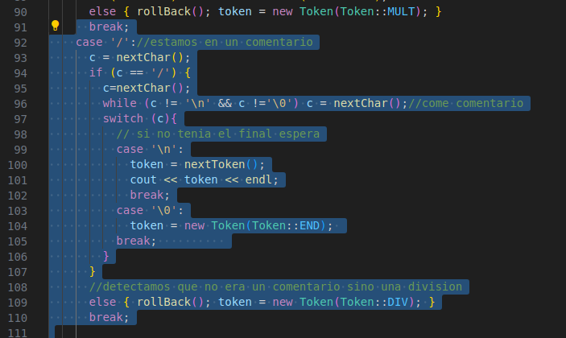</center>

Sabemos que los comentarios son de una línea, por lo tanto deben terminar en \n o \0

> ¿Que cambios se hicieron al scanner y/o parser para lograr la inclusión de comentarios?
- Se modificó la funcion nextToken(), en el caso donde encuentra un '/'
- Lo primero es leer el siguiente carácter y guardarlo en c
- Si c es igual a '/', eso significa que estamos en un comentario
  - Entocnes lo que hacemos es leer cada caracter, hasta no encontrar un '\0' o '\n'
  - Si coinciden con un salto de línea, hacemos que token guarde el siguiente llamado a la función.
  - Si coincide con el final del archivo se le asigna el Token::END a token 
- Si c es diferenta a '/', retrocedemos una posiición, roolBack, y retornamos un token de tipo DIV

## Pregunta 2 (Generación del Código)

Nos piden **Implementar la generación de código objeto para constantes booleanas, los operadores and/or y la versión de for loops considerada por el intérprete: solo considera for-loops con valores ascendentes.**
***Nota: La SVM acepta las instrucciones and y or.***

1. Modificamos el codegean para expresiones booleanas

<center>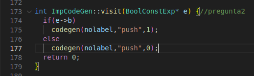</center>

- En la función visit(BoolConstExp* e), se evalua el valor booleano de e, e->b, 
- Si e es true, pusheamos 1 en la pila (sin label)
- Si e es false, pusheamos 0 en la pila (sin label)

2. Modificamos el codegean para and/or

- En la función visit(BinaryExp*e), se genera código objeto para la parte izquierda de la exp. bin
- Luego, generamos el mimo codigo para la parte derecha de la exp. bin
- Se guarda el operador que almacena e->op en un string, con su equivalente en la máquina de pila 
- Se añadió el caso donde el e->op es igual a un operador AND, agremamos `case AND:  op = "and"; break;` 
- Tambien se añadió el caso donde el e->op es igual al o    perador OR, agremamos `case AND:  op = "or"; break;`
- Finalmente fuera del switch llamamos a la función codegen (sin label) y se le envía el operador encontrado, op.

<center>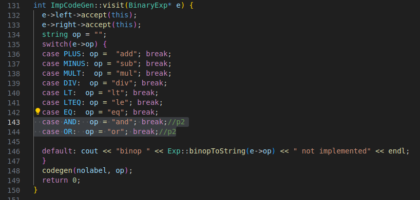</center>

3. Modificamos el codegean para ForStatement
- Primero hemos definido la variable de iteracións s->id en el environment de direcciones

<center>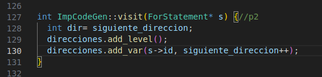</center>

- Analizamos la primera parte de la expresión, s->e1, la cual nos dice donde inicia el iterador. Como recientemente lo hemos evaluado, se podiciona en el top de la pila.
- Creamos código objeto para guardar en memoria el valor analizado de s->e1 y guarmaos en la posición que tiene s->id enviroment
- Analizamos la segunda parte de la expresión, s->e2, la cual nos dice donde termina el iterador

<center>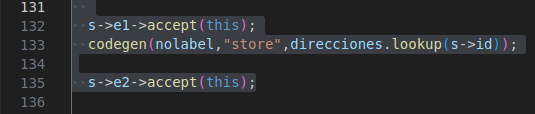</center>

- Conseguimos el label posterior usando next_label
- ALmacemanos el valor en la dirección x en M-espacio auxiliar de la pila 

<center>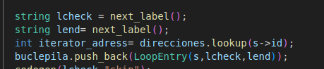</center>

- Creamos código objeto para tener esta estructura en la pila

<center>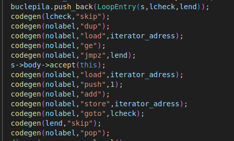</center>

- La sección de código entre **'check'** y **'codegen(body)'** realiza la comparación, y la instrucción que sigue a **'codegen(body)'** incrementa la variable de iteración. Mantenemos 'e2' en la pila, por lo que debemos liberar su espacio en el momento de salir del bucle para mantener la invariante de la pila.

- Al final eliminamos el nivel creado en el enviroment de direcciones y reparamos la dirección posterior que se puede usar en la pila

<center>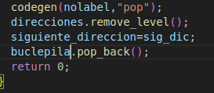</center>


## Pregunta 3 (Sentencia do-while)

**Implementar la interpretación estándar de do-while. Por ejemplo: `x= 0; do x = x+ 1; print(x) while x < 5.` imprime 1,2,3,4,5 Nótese que el do-while no necesita un marcador como enddo. Para delimitar el fin de la sentencia. ¿Se puede implementar el parser? Pero, puede agregarse algo asi si lo desean.**

1. Modificamos es en imp.hh e imp.cpp
- En imp.hh creamos la clase DowhileStatement heredando de la clase Stm 
<center>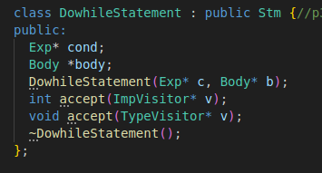</center>

- En imp.cpp adaptamos sus métodos `int DowhileStatement::accept(ImpVisitor* v)` y `void DowhileStatement::accept(TypeVisitor* v)`

<center>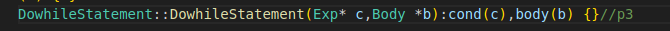</center>

<center>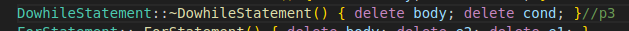</center>

<center>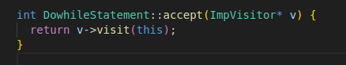</center>

<center>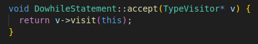</center>

2. Modificamos en imp_parser.cpp 
- Teniendo lsito los tokens para implementar el DoWhileStatement no se realizo modificamos en el Scanner

la estructura que esperamos es de 
```
do
  Body
while Cexp
```
<center>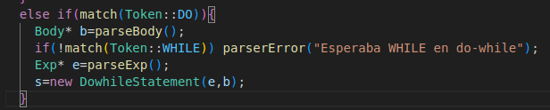</center>

3. Modificamos en Type_visitor.hh
<center>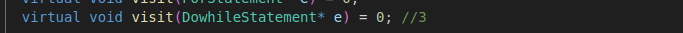</center>

- imp_visitor
<center>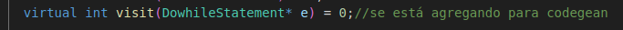</center>

4. Modificamos en imp_printer

- En imp_printer.hh
<center>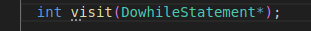</center>

- En imp_printer.cpp
<center></center>

5. Modificamos en Interpreter

- En imp_interpreter.hh
<center></center>

- En imp_interpreter.cpp
<center>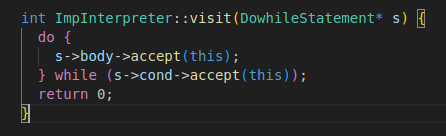</center>

6. Modificamos en Typechecker

- En imp_typechecker.hh

<center>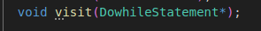</center>

- En imp_typechecker.cpp 
<center>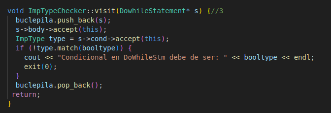</center>

7. Modificamos en Codegen

- En imp_codegen.hh
<center>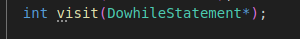</center>

- En imp_codegen.cpp
<center>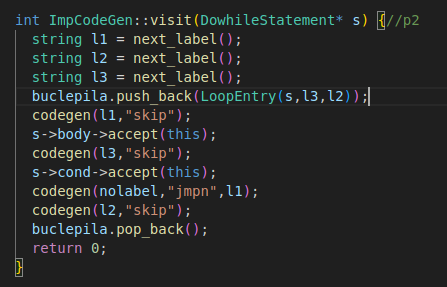</center>


## Pregunta 4 (Sentencias break y continue)

**Implementar las interpretaciones estándar de break y continue, las sentencias que permiten salir y terminar un loop o saltar a la condición de control del loop. Notar que el salto asociado a un continue es distinto para un while-do que para un do-while (al comienzo o al final)**

> Reporte: Indicar el cambio a la gramatica y los puntos donde se hicieron cambios al código. Además, proveer las definiciones de tcheck y codegen usadas


1. Modificamos Scanner (imp_parser)
Hemos agregado las palabras reservadas ***continue*** y ***break*** con los tokens en el scanner

- En imp_parser.hh
<center>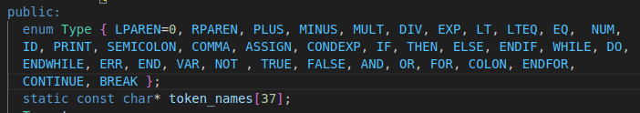</center>

- En imp_parser.cpp
<center>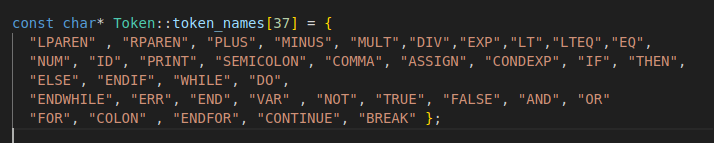</center>

2. Modificamos Parser

- En imp.hh

<center>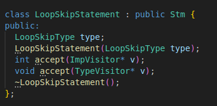</center>

<center>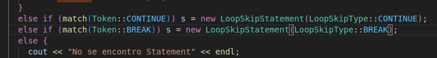</center>

## Resultados

<center></center>
<center></center>
<center></center>
<center></center>
<center></center>
<center></center>
<center></center>
<center></center>


